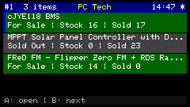
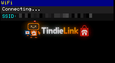
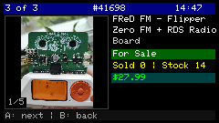
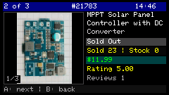

<p align="center">
  
</p>

<p align="center">
  <strong>Your Tindie shop on your desk — live, tiny, and impossible to ignore.</strong><br>
  Firmware for <strong>M5StickC Plus2</strong> · 240×135 landscape · WiFi · seller API v2
</p>

<p align="center">
  
</p>

Stick it where you can see it. The Plus2 has a **small magnet** on the back — slap it on a lamp, a shelf, the fridge, whatever’s in your line of sight while you solder, ship, or pretend to work. Your store syncs in the background; when stock moves or something sells out, you’ll know without opening another browser tab. Little shop monitor, big peace of mind.

---

## What you get

- **Live product list** — up to four rows on screen, scroll when you have more
- **Detail view** — title, status, stock, sold count, price, rating, reviews, product photo
- **Auto-refresh** — polls your store on a timer (default every 60 s)
- **Filtered list** — show only the statuses you care about (for sale, sold out, draft…)
- **Store name in the header** — pulled from the API (`store.name`), not just your slug
- **Dark, readable UI** — built for a tiny LCD, not a phone mockup

---

## On-screen tour

### Boot & WiFi

<p align="center">
  
</p>

| Zone | What it does |
|------|----------------|
| **Header strip** | Shows which phase you’re in (e.g. WiFi setup) |
| **Status line** | Short message — connecting, error, retry hint |
| **SSID line** | Which network it’s joining (long names are trimmed) |
| **Logo panel** | Full-screen TindieLink branding while the stick boots |

---

### Product list

<p align="center">
  
</p>

| Zone | What it does |
|------|----------------|
| **Header · left** | Selected row number + total items in your filtered list |
| **Header · center** | Your **shop display name** (from Tindie API) |
| **Header · right** | Local time; a `*` appears in the reserved slot while a sync runs — layout stays put |
| **Row · title line** | Product name (trimmed with `…` if needed) |
| **Row · meta line** | Status, stock, and sold count in one glance |
| **Row · left bar** | Thin blue marker on the **selected** row only — row colours stay status-based |
| **Row colours** | Background hints at status (for sale, sold out, …), not selection |
| **Footer** | Button hints: open detail / next item |

Up to **four products** visible at once; **BtnB** walks the list, **BtnA** opens detail.

---

### Product detail

<p align="center">
  
  &nbsp;
  
</p>

| Zone | What it does |
|------|----------------|
| **Header · left** | Position in list (`n of total`) |
| **Header · center** | Tindie product ID |
| **Header · right** | Time + fetch indicator (same fixed slot as on the list) |
| **Thumbnail** | Cached product image from Tindie CDN |
| **Photo badge** | `1/N` — which photo you’re seeing of N available |
| **Title block** | Up to **three lines**, word-wrapped — room for long board names |
| **Status bar** | Human-readable listing state (for sale, sold out, …) |
| **Metrics line** | Sold and stock counts |
| **Price bar** | Current price (sale pricing when applicable) |
| **Rating / reviews** | Shown only when the API has data |
| **Footer** | Next product / back to list |

Thumbnails are **cached** (time-to-live and slot count in `config.h`) so scrolling products doesn’t hammer the network.

---

## Controls

| Screen | **BtnA** (front) | **BtnB** (side) |
|--------|------------------|-----------------|
| List | Open detail | Next product |
| Detail | Next product | Back to list |

---

## Configuration (`include/config.h`)

Copy the template and fill in your values:

```bash
cp include/config.h.example include/config.h
```

| Setting | Purpose |
|---------|---------|
| `WIFI_SSID` | Your 2.4 GHz network name |
| `WIFI_PASSWORD` | WiFi password |
| `TINDIE_USERNAME` | Store **slug** from your Tindie URL (not your login email) |
| `TINDIE_API_KEY` | Seller API key from Tindie seller tools |
| `POLL_INTERVAL_SEC` | How often to refresh the product list (seconds, min. 10) |
| `THUMB_CACHE_SLOTS` | How many baked product thumbnails to keep in PSRAM (1–32, LRU eviction) |
| `ORIENTATION_AUTO_FLIP` | `1` = flip LCD 180° via IMU when stick is upside-down on a vertical mount |
| `ORIENTATION_ACCEL_AXIS` | IMU accel axis for flip detection: `0`=X, `1`=Y, `2`=Z (tune on your mount) |
| `ORIENTATION_INVERT` | `1` if flip direction is reversed on your mount |
| `ORIENTATION_DEBUG` | `1` = IMU debug on Serial (`__DBG__` NDJSON ~every 800 ms + flip lines). Capture: `pio device monitor \| python3 tools/debug_serial_ingest.py` |
| `TIMEZONE_TZ` | POSIX timezone string for the clock in the header |
| `TIMEZONE_DST_AUTO` | `1` = automatic summer/winter time; `0` = fixed offset |
| `TIMEZONE_OFFSET_SEC` | Fixed UTC offset when DST auto is off |
| `LIST_SHOW_FOR_SALE` | `1` = show in-stock / for-sale listings |
| `LIST_SHOW_SOLD_OUT` | `1` = show sold-out listings |
| `LIST_SHOW_DRAFT` | `1` = show drafts (only if returned by API v2 list) |
| `LIST_SHOW_RETIRED` | `1` = show retired listings |
| `LIST_SHOW_UNKNOWN` | `1` = show items with unrecognized status |
| `UI_FRAME_DUMP` | `1` = stream framebuffer over USB for screenshots (dev only) |

`include/config.h` is gitignored — never commit keys.

---

## Supported hardware

| Device | Status | Notes |
|--------|--------|-------|
| **M5StickC Plus2** | Supported | Tested target — 240×135 LCD (landscape), 2 buttons, WiFi, IMU, buzzer, battery |
| **M5StickS3** | Planned | Same **240×135** panel; UI should port cleanly. Needs a separate PlatformIO env and button/power differences. **Not tested yet** — support will be added when there’s time and interest. PRs welcome if you have hardware on the bench. |

**Not supported:** original M5StickC (smaller display), M5Stack Core, Paper, and other boards.

---

## Build & flash

```bash
python3 -m venv .venv
.venv/bin/pip install -U platformio
.venv/bin/pio run -e m5stickc-plus2 -t upload
```

USB connected, monitor closed while uploading. First boot: WiFi screen → list when sync succeeds.

**Requirements:** M5StickC **Plus2**, Arduino/PlatformIO toolchain, 2.4 GHz WiFi, Tindie seller API access.

---

## License

MIT — see [LICENSE](LICENSE).

<p align="center">
  <sub>Made for makers who sell on Tindie and want their shop in peripheral vision — not another tab.</sub>
</p>
